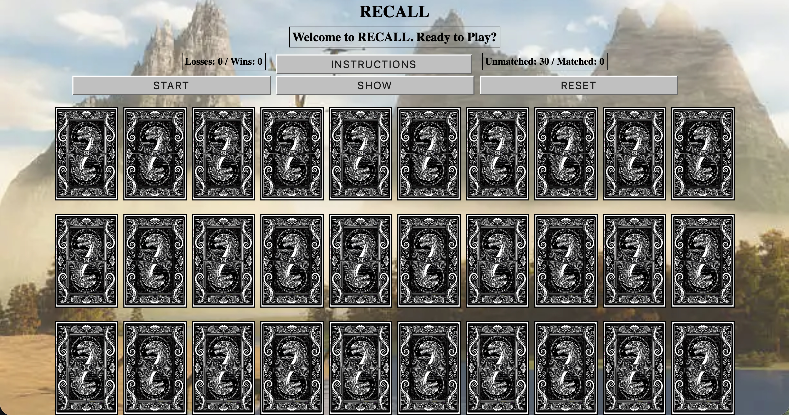

# __Recall__

## Description
This is a concentration based game where you must "recall" the positions of cards. Helps train the brain strengthening the players memory as they challenge themselves. Only becoming more difficult the more successful matchs the player makes. 

## Instructions
The game is a played on a 30 card board containing 15 pairs. At first you are able to see the entire board using the "SHOW" button. Once the "START" button is pressed the game begins, all cards are hidden until chosen for a potential match. Using your recollection of the board, you must match the identical pairs. With each match the pair is removed from the board. Until the board is clear, resulting in a win. 

## Rules
Only two cards can be revealed per turn attempting to match a pair.
If you fail to make a match or the 10 second timer runs out during your turn, that turn is a failure. 
After four failed turns the player losses the match.   

## Attributions
I used [Unsplash](
https://unsplash.com/s/photos/brain-art)
to source all of the images for the app. 

It was developed using HTML, CSS and JavaScript.

## Next Steps
Future enhancements
Could include a difficulty setting which constrains the player even more. A few methods I've thought of would inlcude adding additional timers and shortenig existing timers. Also decreasing the amount of chances before loss. Maybe even increasing the size of the board.